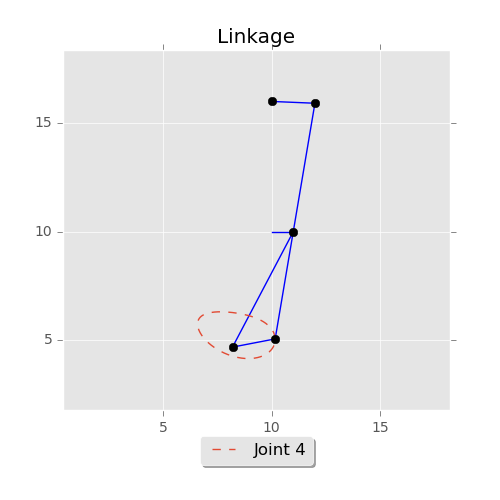

# Plynk: A General Linkage Mechanism Simulator

Plynk is a Python library that provides geometric simulation of planar linkage mechanisms. 

## Installation
Plynk depends on Matplotlib and numpy. 

Plynk is a self-contained Python package. To use it, download the `plynk` folder and place it in the same directory as the code that imports it. 

## Usage Example
```python
from plynk import Joint, Bar, Linkage, joint, visualization
from plynk.driver.crank import Crank

j1 = Joint("j1", location = (10, 16), fixed = True)
j2 = Joint("j2", chooser = joint.greater_x)
j3 = Joint("j3")
j4 = Joint("j4")
j5 = Joint("j5", chooser = joint.lesser_x)
top_bar = Bar("top_bar", [j1, j2], [2])
main_bar = Bar("main", [j2, j3, j4], [6, 5])
hypot = Bar("hypot", [j3, j5], [6])
base = Bar("base", [j4, j5], [2])
crank = Crank("crank", (10, 10), j3, 1)

linkage = Linkage([top_bar, main_bar, hypot, base],
                  [j1, j2, j3, j4, j5],
                  [crank])

visualization.linkage_image(linkage, track_joints=[("Joint 4", j4)]).show()

raw_input("Press enter to exit.")
```
Running this script produces the following graphic showing an example linkage mechanism and the path traced by the movement of one of its joints over time:

